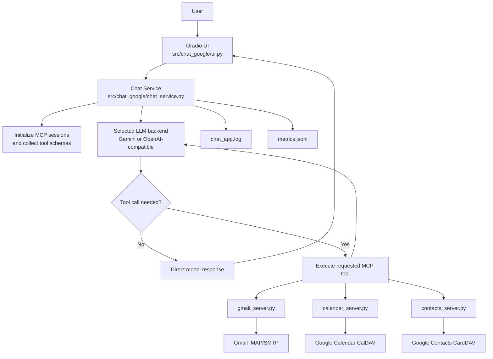

# Chat MCP Google

[](https://www.python.org/downloads/)


A production-oriented Gradio chat application that integrates LLM tool-calling with three Google-focused MCP servers:
- Gmail (IMAP/SMTP)
- Google Calendar (CalDAV)
- Google Contacts (CardDAV)

The application supports two model backends:
- Direct Gemini models via `google-genai`
- OpenAI-compatible models via `BASE_URL` and `API_KEY`

## Key Features

- Gradio chat interface with model selection.
- Automatic MCP tool discovery and tool-calling.
- Integrated Gmail, Calendar, and Contacts actions.
- Contacts search resilience: automatically falls back to HTTP/1.1 when `h2` is unavailable.
- Request-level metrics in `metrics.jsonl`.
- Runtime logs in `chat_app.log`.
- Pydantic-based validation for app settings, payload normalization, and tool inputs.

## Quick Start

```powershell
Copy-Item .env.template .env
uv sync
uv run python app.py
```

## Architecture

The `chat_service` flow is:
1. Start MCP servers through stdio (`uv run python <server>.py`).
2. Collect tool schemas from each server.
3. Send user input to the selected model backend first.
4. The model either responds directly or requests a tool call.
5. If a tool call is requested, execute the corresponding MCP tool and return the result to the model.



## Repository Layout

- `app.py`: UI entrypoint (backward-compatible wrapper).
- `gmail_server.py`: Gmail MCP wrapper entrypoint.
- `calendar_server.py`: Calendar MCP wrapper entrypoint.
- `contacts_server.py`: Contacts MCP wrapper entrypoint.
- `src/chat_google/chat_service.py`: main orchestration logic.
- `src/chat_google/ui.py`: Gradio UI composition and event wiring.
- `src/chat_google/constants.py`: model list and default model resolver.
- `src/chat_google/models.py`: shared Pydantic models.
- `src/chat_google/mcp_servers/*.py`: MCP server implementations.
- `tests/`: comprehensive async/unit test suite.
- `requirements.txt`: runtime dependencies.
- `requirements-dev.txt`: runtime + test dependencies.
- `pyproject.toml`: pytest configuration.
- `readme-id.md`: short pointer note to the primary English `README.md`.

## Prerequisites

- Python 3.10+
- `uv` installed and available in `PATH`
- Google account with:
  - 2-Step Verification enabled
  - App Password enabled and generated

## Configuration

Use the template to initialize environment variables:

```powershell
Copy-Item .env.template .env
```

Then edit `.env`:

```env
GOOGLE_ACCOUNT=you@example.com
GOOGLE_APP_KEY=xxxxxxxxxxxxxxxx
GOOGLE_GEMINI_API_KEY=your_gemini_key
BASE_URL=https://ai.sumopod.com
API_KEY=your_api_key
MODEL=gemini-3-flash-preview
```

Variable reference:
- `GOOGLE_ACCOUNT`: Google account used by Gmail/Calendar/Contacts MCP servers.
- `GOOGLE_APP_KEY`: Google App Password (16 characters, no spaces).
- `GOOGLE_GEMINI_API_KEY`: required for models that start with `gemini`.
- `BASE_URL`: OpenAI-compatible API base URL for non-Gemini models.
- `API_KEY`: bearer token for `BASE_URL`.
- `MODEL`: initial default model for the UI dropdown (must exist in available model list).

## How to Get Google App Password (Personal Account)

1. Open `https://myaccount.google.com/`.
2. Go to `Security`.
3. Enable `2-Step Verification`.
4. Open App Passwords: `https://myaccount.google.com/apppasswords`.
5. Generate an app password for Mail (or a custom app name).
6. Put the generated 16-character password into `GOOGLE_APP_KEY`.

Important notes:
- App Passwords are only available when 2-Step Verification is enabled.
- App Passwords may be blocked by organization policies (Workspace admin), Advanced Protection, or strict 2SV configurations.
- Changing the main Google account password may revoke existing App Passwords.

## Recommended uv Workflow

For stable and reproducible setup:

```powershell
uv sync
uv run python app.py
```

Notes:
- `uv sync` installs/synchronizes project dependencies.
- `uv run` executes commands in the resolved environment.

## Run the Application

```powershell
uv run python app.py
```

Default local URL: `http://127.0.0.1:7860`

## Run MCP Servers Manually

```powershell
uv run python gmail_server.py
uv run python calendar_server.py
uv run python contacts_server.py
```

## MCP Tools

### Gmail
- `list_recent_emails(count=5)`
- `read_email(email_id)`
- `summarize_emails(timeframe='24h', label='inbox', count=10)`
- `list_unread_emails(count=5)`
- `mark_as_read(email_id)`
- `list_labels()`
- `search_emails_by_label(label, count=5)`
- `search_emails(query)`
- `send_email(to_email, subject, body)`

### Calendar
- `summarize_agenda(timeframe='24h', days=None)`
- `list_events(days=7)`
- `add_event(summary, start_time, duration_minutes=60, description='')`
- `search_events(query)`

### Contacts
- `list_contacts(limit=10)`
- `search_contacts(query)`

## Testing

Run the full test suite with `uv`:

```powershell
uv run --with pytest --with pytest-asyncio --with-requirements requirements.txt pytest -q
```

Coverage includes:
- All Gmail tools
- All Calendar tools
- All Contacts tools
- Core chat orchestration paths (Gemini, OpenAI-compatible, streaming, tool-calls, payload normalization)
- Default model resolution behavior

## Observability

- `chat_app.log`: runtime logs, tool invocation traces, tool duration, fallback behavior, and exception stack traces.
- `metrics.jsonl`: per-request telemetry:
  - Core fields: `timestamp`, `request_id`, `model`, `user_question`, `duration_seconds`, `invoked_tools`, `invoked_servers`, `status`
  - Error fields: `error_message`, `tool_errors`
  - `status` can include `success_with_tool_errors` when a response completes but one or more tools returned error content.

## Troubleshooting

1. MCP tools are unavailable
- Confirm `uv` is installed and in `PATH`.
- Confirm dependencies are synced (`uv sync`).
- Start MCP servers manually and inspect errors.

2. Google authentication fails
- Verify `GOOGLE_ACCOUNT` and `GOOGLE_APP_KEY`.
- Confirm 2-Step Verification is enabled.
- Regenerate App Password if needed.

3. Gemini requests fail
- Check `GOOGLE_GEMINI_API_KEY`.
- Confirm model name starts with `gemini`.

4. Non-Gemini requests fail
- Verify `BASE_URL` and `API_KEY`.
- Confirm your endpoint supports chat completions and tool-calling.

5. Contact search says "technical issue"
- The contacts server now auto-disables HTTP/2 when `h2` is missing, so it can still run via HTTP/1.1.
- If Google CardDAV `REPORT` search returns `5xx`, the server automatically falls back to `PROPFIND` + local filtering.
- Check `chat_app.log` for lines containing `search_contacts REPORT failed` and `fallback PROPFIND completed`.

## Security Notes

- Never commit `.env`.
- Treat logs and metrics as potentially sensitive data.
- Run this application only in trusted environments.

