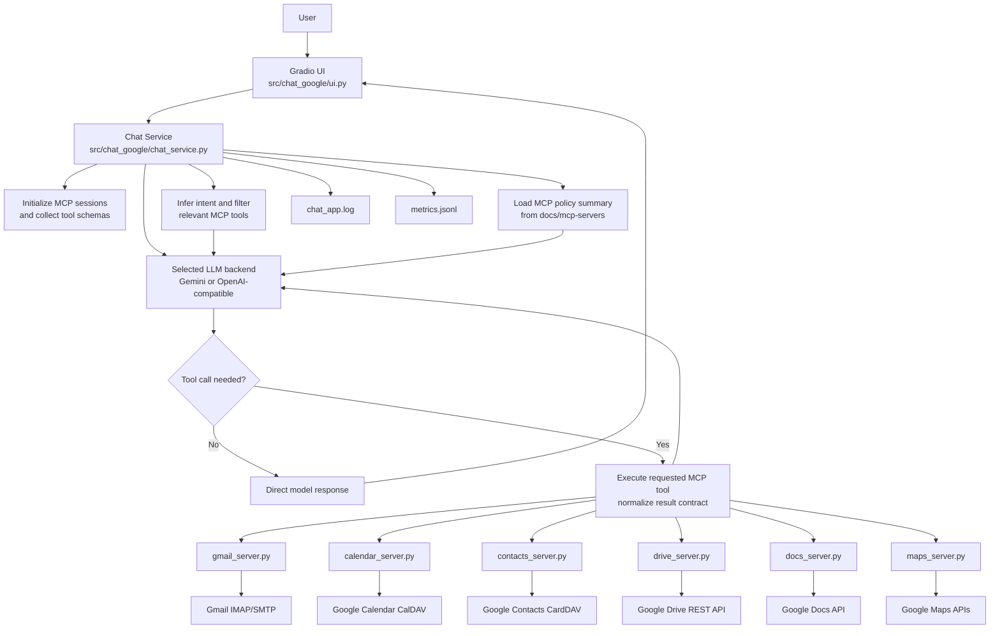

# Chat MCP Google

[](https://www.python.org/downloads/)


A production-oriented Gradio chat application that integrates LLM tool-calling with six Google-focused MCP servers:
- Gmail (IMAP/SMTP)
- Google Calendar (CalDAV)
- Google Contacts (CardDAV)
- Google Drive (Drive REST API)
- Google Docs (Docs REST API + Drive metadata)
- Google Maps (Maps/Places/Geocoding/Directions APIs)

The application supports two model backends:
- Direct Gemini models via `google-genai`
- OpenAI-compatible models via `BASE_URL` and `API_KEY`

Current OpenAI-compatible (non-Gemini) models:
- `deepseek-v3-2-251201`
- `deepseek-r1-250528`
- `glm-4-7-251222`
- `glm-5`
- `kimi-k2-250905`
- `kimi-k2-thinking-251104`
- `seed-1-8-251228`
- `whisper-1`
- `azure_ai/kimi-k2.5`

Current Gemini models:
- `gemini-3-flash-preview`
- `gemini-3-pro-preview`
- `gemini-2.5-pro`
- `gemini-2.5-flash`
- `gemini-2.5-flash-lite`

## Key Features

- Gradio chat interface with model selection.
- Automatic MCP tool discovery and tool-calling.
- Intent-based MCP tool gating (only relevant server tools are sent to the model per request).
- Runtime MCP policy injection from `docs/mcp-servers/*.md` into system instructions.
- Multi-round tool-call orchestration for OpenAI-compatible models (tool -> tool -> final answer).
- Integrated Gmail, Calendar, Contacts, Drive, Docs, and Maps actions.
- Auto-invite flow: when prompt includes `invite` + email and event is created, app sends invitation via Gmail MCP.
- Calendar invitation delivery supports `.ics` (`text/calendar`) accept/reject flow.
- Drive phase 1.1 includes folder creation, text upload, move, user sharing, and public link creation.
- Contacts search resilience: automatically falls back to HTTP/1.1 when `h2` is unavailable.
- Tool output truncation before model feedback to reduce context bloat on large tool results.
- Structured tool-result contract (`success`, `error`, `data`) between MCP tool execution and model context.
- Request-scoped MCP availability notice in final response when required server(s) are down.
- Explicit timeout handling for OpenAI-compatible model calls.
- Request-level metrics in `metrics.jsonl`.
- Runtime logs in `chat_app.log`.
- Pydantic-based validation for app settings, payload normalization, and tool inputs.

## Quick Start

```powershell
Copy-Item .env.template .env
uv sync
uv run python app.py
```

## Architecture

The `chat_service` flow is:
1. Start MCP servers through stdio (`uv run python <server>.py`).
2. Collect tool schemas from each server.
3. Infer intent domain from user input and filter to relevant server tools.
4. Inject MCP policy summary (from `docs/mcp-servers/*.md`) into system instruction.
5. Send user input to the selected model backend.
6. The model either responds directly or requests tool calls.
7. Execute requested MCP tools, normalize results into a structured contract, then return them to the model.



## Repository Layout

- `app.py`: UI entrypoint (backward-compatible wrapper).
- `gmail_server.py`: Gmail MCP wrapper entrypoint.
- `calendar_server.py`: Calendar MCP wrapper entrypoint.
- `contacts_server.py`: Contacts MCP wrapper entrypoint.
- `drive_server.py`: Drive MCP wrapper entrypoint.
- `docs_server.py`: Docs MCP wrapper entrypoint.
- `maps_server.py`: Maps MCP wrapper entrypoint.
- `src/chat_google/chat_service.py`: main orchestration logic.
- `src/chat_google/ui.py`: Gradio UI composition and event wiring.
- `src/chat_google/constants.py`: model list and default model resolver.
- `src/chat_google/models.py`: shared Pydantic models.
- `src/chat_google/mcp_servers/*.py`: MCP server implementations.
- `docs/mcp-servers/*.md`: agent-oriented MCP usage guides consumed as runtime MCP policy summary.
- `tests/`: comprehensive async/unit test suite.
- `requirements.txt`: runtime dependencies.
- `requirements-dev.txt`: runtime + test dependencies.
- `pyproject.toml`: pytest configuration.
- `readme-id.md`: short pointer note to the primary English `README.md`.

## Prerequisites

- Python 3.10+
- `uv` installed and available in `PATH`
- Google account with:
  - 2-Step Verification enabled
  - App Password enabled and generated
- Google Cloud project with Drive API enabled (for `GOOGLE_DRIVE_ACCESS_TOKEN`)
- Google Cloud project with Google Docs API enabled (for Docs MCP tools)
- OAuth client credentials (`Desktop app`) for Drive auto-refresh flow
  - `GOOGLE_OAUTH_CLIENT_ID`
  - `GOOGLE_OAUTH_CLIENT_SECRET`
- Google Cloud project with Maps APIs enabled (for `GOOGLE_MAPS_API_KEY`)

## Configuration

Use the template to initialize environment variables:

```powershell
Copy-Item .env.template .env
```

Then edit `.env`:

```env
GOOGLE_ACCOUNT=you@example.com
GOOGLE_APP_KEY=xxxxxxxxxxxxxxxx
GOOGLE_DRIVE_ACCESS_TOKEN=your-drive-access-token
GOOGLE_DRIVE_REFRESH_TOKEN=your-drive-refresh-token
GOOGLE_OAUTH_CLIENT_ID=your-oauth-client-id.apps.googleusercontent.com
GOOGLE_OAUTH_CLIENT_SECRET=your-oauth-client-secret
GOOGLE_MAPS_API_KEY=your-google-maps-api-key
GOOGLE_GEMINI_API_KEY=your_gemini_key
BASE_URL=https://ai.sumopod.com
API_KEY=your_api_key
MODEL=azure_ai/kimi-k2.5
```

Variable reference:
- `GOOGLE_ACCOUNT`: Google account used by Gmail/Calendar/Contacts MCP servers.
- `GOOGLE_APP_KEY`: Google App Password (16 characters, no spaces).
- `GOOGLE_DRIVE_ACCESS_TOKEN`: OAuth 2.0 Bearer token for Drive/Docs MCP (not App Password).
- `GOOGLE_DRIVE_REFRESH_TOKEN`: optional refresh token for automatic Drive/Docs token renewal.
- `GOOGLE_OAUTH_CLIENT_ID`: OAuth client ID paired with `GOOGLE_DRIVE_REFRESH_TOKEN`.
- `GOOGLE_OAUTH_CLIENT_SECRET`: OAuth client secret paired with `GOOGLE_DRIVE_REFRESH_TOKEN`.
- `GOOGLE_MAPS_API_KEY`: Google Maps API key for Maps MCP tools.
- `GOOGLE_GEMINI_API_KEY`: required for models that start with `gemini`.
- `BASE_URL`: OpenAI-compatible API base URL for non-Gemini models.
- `API_KEY`: bearer token for `BASE_URL`.
- `MODEL`: initial default model for the UI dropdown (must exist in available model list).
  - If missing/invalid, app fallback default is `azure_ai/kimi-k2.5`.

## How to Get Google App Password (Personal Account)

1. Open `https://myaccount.google.com/`.
2. Go to `Security`.
3. Enable `2-Step Verification`.
4. Open App Passwords: `https://myaccount.google.com/apppasswords`.
5. Generate an app password for Mail (or a custom app name).
6. Put the generated 16-character password into `GOOGLE_APP_KEY`.

Important notes:
- App Passwords are only available when 2-Step Verification is enabled.
- App Passwords may be blocked by organization policies (Workspace admin), Advanced Protection, or strict 2SV configurations.
- Changing the main Google account password may revoke existing App Passwords.

## How to Get `GOOGLE_DRIVE_ACCESS_TOKEN` (Individual Account)

1. Open Google Cloud Console: `https://console.cloud.google.com/`.
2. Create/select a project, then enable Google Drive API: `APIs & Services` -> `Library` -> `Google Drive API` -> `Enable`.
3. Configure OAuth consent screen (`External` is fine for personal use) and add your account as test user if needed.
4. Create OAuth Client ID credentials (`Desktop app`) in `APIs & Services` -> `Credentials`.
5. Open OAuth 2.0 Playground: `https://developers.google.com/oauthplayground/`.
6. Click the settings icon in OAuth Playground and enable `Use your own OAuth credentials`, then input your client ID/secret.
7. Select scope `https://www.googleapis.com/auth/drive`, authorize, and exchange code for tokens.
8. Copy the `access_token` value into `.env` as `GOOGLE_DRIVE_ACCESS_TOKEN`.

Important notes:
- This token is an OAuth Bearer token, not App Password.
- Access token is short-lived (commonly around 1 hour). If you do not use refresh flow, regenerate it when expired.
- For long-lived usage, set refresh flow variables:
  - `GOOGLE_DRIVE_REFRESH_TOKEN`
  - `GOOGLE_OAUTH_CLIENT_ID`
  - `GOOGLE_OAUTH_CLIENT_SECRET`

Programmatic helper script (root):

```powershell
uv run --with google-auth-oauthlib python get_google_drive_access_token.py --client-secret client_secret.json
```

By default this script now writes to `.env`:
- `GOOGLE_DRIVE_ACCESS_TOKEN`
- `GOOGLE_DRIVE_REFRESH_TOKEN` (if returned by Google)
- `GOOGLE_OAUTH_CLIENT_ID`
- `GOOGLE_OAUTH_CLIENT_SECRET`

Optional flags:

```powershell
# only write access token
uv run --with google-auth-oauthlib python get_google_drive_access_token.py --client-secret client_secret.json --no-write-refresh-token --no-write-oauth-client

# print token only (do not modify .env)
uv run --with google-auth-oauthlib python get_google_drive_access_token.py --client-secret client_secret.json --no-write-env
```

Default scope in this script is full Drive access:
- `https://www.googleapis.com/auth/drive`

## Google Docs API Setup Notes

- Enable `Google Docs API` in the same GCP project as your OAuth credentials.
- Existing token flow in `get_google_drive_access_token.py` (scope `https://www.googleapis.com/auth/drive`) is compatible with Docs MCP in this repository.
- Docs MCP and Drive MCP share the same token environment variables.

## How to Get `GOOGLE_OAUTH_CLIENT_ID` and `GOOGLE_OAUTH_CLIENT_SECRET`

1. Open Google Cloud Console: `https://console.cloud.google.com/`.
2. Select your project.
3. Go to `APIs & Services` -> `Credentials`.
4. Create OAuth client credentials (`Desktop app`) if not created yet.
5. Download the client secret JSON file.
6. Read from the JSON:
   - `installed.client_id` -> `GOOGLE_OAUTH_CLIENT_ID`
   - `installed.client_secret` -> `GOOGLE_OAUTH_CLIENT_SECRET`

You can avoid manual copy by running:

```powershell
uv run --with google-auth-oauthlib python get_google_drive_access_token.py --client-secret client_secret.json
```

It extracts and writes both values automatically (unless disabled by flags).

## How to Get `GOOGLE_MAPS_API_KEY` and Required APIs

1. Open Google Cloud Console: `https://console.cloud.google.com/`.
2. Create/select a project for this app.
3. Enable billing for the project (Google Maps Platform requires an active billing account).
4. Go to `APIs & Services` -> `Library`, then enable these APIs:
   - `Geocoding API`
   - `Directions API`
   - `Places API` (used for text search and place details)
5. Go to `APIs & Services` -> `Credentials` -> `Create Credentials` -> `API key`.
6. Copy the key into `.env` as:
   - `GOOGLE_MAPS_API_KEY=your-google-maps-api-key`

Recommended key restrictions:
- Application restrictions:
  - For local/server use, prefer `IP addresses` and allow only your server IP.
- API restrictions:
  - Restrict key to:
    - `Geocoding API`
    - `Directions API`
    - `Places API`

Validation checklist:
- `GOOGLE_MAPS_API_KEY` exists in `.env`.
- The 3 APIs above are enabled in the same project as the key.
- Billing is active on that project.

Programmatic helper script (root):

```powershell
# One-time auth for script token discovery
gcloud auth login
gcloud auth application-default login

# Create restricted key, enable required APIs, and write GOOGLE_MAPS_API_KEY to .env
uv run python get_google_maps_api_key.py --project YOUR_PROJECT_ID
```

If `gcloud` is not installed, use OAuth client secret fallback:

```powershell
uv run --with google-auth-oauthlib python get_google_maps_api_key.py --project YOUR_PROJECT_ID --client-secret client_secret.json
```

Optional examples:

```powershell
# Create key without automatic API restrictions
uv run python get_google_maps_api_key.py --project YOUR_PROJECT_ID --no-api-restrictions

# Restrict key to server IP(s)
uv run python get_google_maps_api_key.py --project YOUR_PROJECT_ID --allowed-ip 203.0.113.10

# Do not modify .env (print key only)
uv run python get_google_maps_api_key.py --project YOUR_PROJECT_ID --no-write-env
```

Shell note:
- Use the full flag in one token: `--no-api-restrictions` (not split across lines like `--no-api-` then `restrictions`).

## Recommended uv Workflow

For stable and reproducible setup:

```powershell
uv sync
uv run python app.py
```

Notes:
- `uv sync` installs/synchronizes project dependencies.
- `uv run` executes commands in the resolved environment.

## Run the Application

```powershell
uv run python app.py
```

Default local URL: `http://127.0.0.1:7860`

## Run MCP Servers Manually

```powershell
uv run python gmail_server.py
uv run python calendar_server.py
uv run python contacts_server.py
uv run python drive_server.py
uv run python docs_server.py
uv run python maps_server.py
```

## MCP Tools

### Gmail
- `list_recent_emails(count=5)`
- `read_email(email_id)`
- `summarize_emails(timeframe='24h', label='inbox', count=10)`
- `list_unread_emails(count=5)`
- `mark_as_read(email_id)`
- `list_labels()`
- `search_emails_by_label(label, count=5)`
- `search_emails(query)`
- `send_email(to_email, subject, body)`
- `send_calendar_invite_email(to_email, subject, body, summary, start_time, duration_minutes=60, description='', location='')`

### Calendar
- `summarize_agenda(timeframe='24h', days=None)`
- `list_events(days=7)`
- `add_event(summary, start_time, duration_minutes=60, description='')`
- `search_events(query)`

Note:
- `add_event` still has no structured attendees/location fields.
- Invitation is handled by Gmail MCP (`send_calendar_invite_email`) with ICS data so recipient can accept/reject.

### Contacts
- `list_contacts(limit=10)`
- `search_contacts(query)`

### Drive (Phase 1 + 1.1)
- `list_drive_files(limit=10, folder_id=None, mime_type=None)`
- `search_drive_files(query, limit=10, folder_id=None)`
- `get_drive_file_metadata(file_id)`
- `read_drive_text_file(file_id, max_chars=8000)` (non-Google Workspace files only)
- `list_shared_with_me(limit=10)`
- `create_drive_folder(name, parent_id=None)`
- `upload_text_file(name, content, parent_id=None)`
- `move_drive_file(file_id, new_parent_id)` (works for files/folders)
- `create_drive_shared_link_to_user(item_id, user_email, role='reader', send_notification=True, message='', expires_in_days=7)`
- `create_drive_public_link(item_id, role='reader', allow_discovery=False)` (file/folder)

### Docs (Phase 1 + 1.1)
- `list_docs_documents(limit=10)`
- `search_docs_documents(query, limit=10)`
- `get_docs_document_metadata(document_id)`
- `read_docs_document(document_id, max_chars=8000)`
- `create_docs_document(title, initial_content='')`
- `append_docs_text(document_id, text)`
- `replace_docs_text(document_id, find_text, replace_text='', match_case=False)`
- `share_docs_to_user(document_id, user_email, role='reader', send_notification=True, message='')`
- `export_docs_document(document_id, export_format='pdf', max_chars=8000)` (`txt`, `html`, `pdf`, `docx`)
- `append_docs_structured_content(document_id, heading='', paragraph='', bullet_items=[], numbered_items=[])`
- `replace_docs_text_if_revision(document_id, expected_revision_id, find_text, replace_text='', match_case=False)`

### Maps
- `search_places_text(query, limit=5, language='en', region=None)`
- `geocode_address(address, limit=3, language='en', region=None)`
- `reverse_geocode(latitude, longitude, limit=3, language='en')`
- `get_place_details(place_id, language='en')`
- `get_directions(origin, destination, mode='driving', alternatives=False, language='en', units='metric', departure_time=None)`

## Testing

Run the full test suite with `uv`:

```powershell
uv run --with pytest --with pytest-asyncio --with-requirements requirements.txt pytest -q
```

Coverage includes:
- All Gmail tools
- All Calendar tools
- All Contacts tools
- All Drive phase-1 and phase-1.1 tools
- All Maps tools
- Core chat orchestration paths (Gemini, OpenAI-compatible, streaming, tool-calls, payload normalization)
- Default model resolution behavior

### Live Smoke Test (No UI)

Use this to validate a real query directly through `chat_service` (without Gradio UI):

```powershell
$env:RUN_LIVE_SMOKE="1"
$env:SMOKE_MODEL="azure_ai/kimi-k2.5"
$env:SMOKE_PROMPT="find recent emails from social school, summarize"
uv run --with pytest --with pytest-asyncio --with-requirements requirements.txt pytest -q tests/test_live_smoke_no_ui.py -m live_smoke
```

Notes:
- This test calls real external APIs and can consume quota.
- If `SMOKE_MODEL` starts with `gemini`, set `GOOGLE_GEMINI_API_KEY`.
- For non-Gemini models, set `BASE_URL` and `API_KEY`.

## Observability

- `chat_app.log`: runtime logs, tool invocation traces, tool duration, fallback behavior, and exception stack traces.
- `metrics.jsonl`: per-request telemetry:
  - Core fields: `timestamp`, `request_id`, `model`, `user_question`, `duration_seconds`, `invoked_tools`, `invoked_servers`, `status`
  - Error fields: `error_message`, `tool_errors`
  - `status` can include `success_with_tool_errors` when a response completes but one or more tools returned error content.
  - `request_id` format: `<YYYYMMDD-HHMMSS>-<8hex>` (collision-safe for concurrent requests).

## Troubleshooting

1. MCP tools are unavailable
- Confirm `uv` is installed and in `PATH`.
- Confirm dependencies are synced (`uv sync`).
- Start MCP servers manually and inspect errors.

2. Google authentication fails
- Verify `GOOGLE_ACCOUNT` and `GOOGLE_APP_KEY`.
- Confirm 2-Step Verification is enabled.
- Regenerate App Password if needed.

3. Gemini requests fail
- Check `GOOGLE_GEMINI_API_KEY`.
- Confirm model name starts with `gemini`.

4. Non-Gemini requests fail
- Verify `BASE_URL` and `API_KEY`.
- Confirm your endpoint supports chat completions and tool-calling.
- The app now supports multi-round tool calls for non-Gemini models; if a query is very broad and times out, retry with a narrower prompt.

5. Invite flow expectations
- If prompt includes `invite` and one or more email addresses, app attempts to send ICS invitation email after event creation.
- If calendar invite delivery cannot be used, app falls back to plain text email.
- Check `metrics.jsonl` `invoked_tools` for `send_calendar_invite_email` or `send_email`.

6. Contact search says "technical issue"
- The contacts server now auto-disables HTTP/2 when `h2` is missing, so it can still run via HTTP/1.1.
- If Google CardDAV `REPORT` search returns `5xx`, the server automatically falls back to `PROPFIND` + local filtering.
- Check `chat_app.log` for lines containing `search_contacts REPORT failed` and `fallback PROPFIND completed`.

7. Drive tools fail with 401/403
- Check `GOOGLE_DRIVE_ACCESS_TOKEN` is set and not expired.
- Prefer configuring refresh flow to avoid manual token renewal:
  - `GOOGLE_DRIVE_REFRESH_TOKEN`
  - `GOOGLE_OAUTH_CLIENT_ID`
  - `GOOGLE_OAUTH_CLIENT_SECRET`
- Ensure Drive API is enabled in your Google Cloud project.
- Ensure OAuth scope includes `https://www.googleapis.com/auth/drive` (default script scope).
- Remember: `GOOGLE_APP_KEY` cannot be used for Drive API.
- If write/share/public-link tools fail with 403, re-generate token with full Drive scope.

8. Google Docs tools fail with 401/403
- Ensure Google Docs API is enabled in your Google Cloud project.
- Ensure token includes Docs/Drive access (existing Drive full scope is compatible).
- Ensure the authenticated account has access to the target document.

9. Response includes warning about unavailable MCP server
- This appears when your request domain needs a server that failed to initialize.
- Check `chat_app.log` lines containing `Failed to start MCP server`.
- Start the affected server manually (`uv run python <server>_server.py`) and retry.

## Security Notes

- Never commit `.env`.
- Treat logs and metrics as potentially sensitive data.
- Run this application only in trusted environments.

